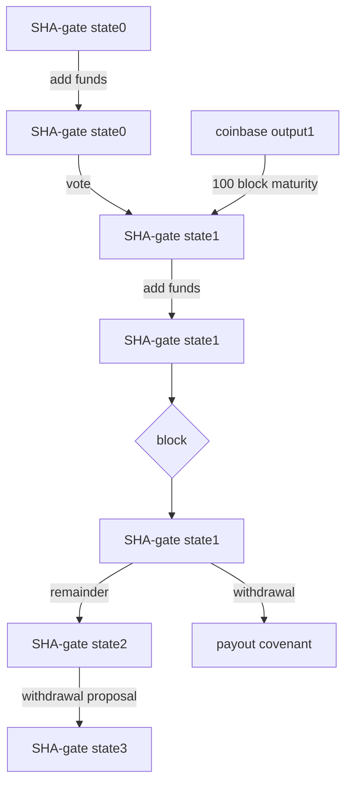

# Upgraded SHA-gate

A description of an improved SHA-gate contract, starting from the problems of the previous implementation.

## Problems with V1

1) Each time a LP bridges funds to SBCH is a separate SHA-gate, this requires too much voting (which is the source of the "Bitmain firmware issue" & makes blocking invalid withdrawals too difficult)
 2) Trust-minimized bridge only usable for LPs, not normal users
 3) Contract does not check voting period which makes the setup insecure
 4) Impossible OP-return requirement
 5) A total of 3 operators is perceived as too few

**The first three are major issues**, the fourth seems to be an attempted solution for issue three and the fifth can easily be solved with the extra space enabled by native introspection.
 
## New architecture

The first problem comes from the modular architecture of having Liquidity Providers (LPs) create separate SHA-gate contract to bridge a large sum each time. Instead you can have a reusable bridge which can bridge funds to SBCH many times and can process many withdrawals from SBCH back to the mainchain.

> 1) Each time a LP adds funds to SBCH is a separate SHA-gate which requires too much voting (this is the source of the "Bitmain firmware issue" & makes blocking invalid withdrawals too difficult)

Having a reusable bridge solves this first issue because miners only need to vote on one SHA-gate contract. This does away with the Bitmain Firmware issue and make the whole setup more secure. 
 
 - [x]  With new architecture miners need to vote one time each coinbase at most

The new architecture also solves the second issue. 
>  2) Trust-minimized bridge only usable for LPs, not normal users

On V1 users would be required to use trusted middlemen to bridge to SBCH because there would be a high minimum amount to open a valid SHA-gate because of the limited votes and resulting limited security (issue 1). It would also not be workable for users as you can only withdraw the same amount you entered SBCH with (a user would need to buy or sell the SBCH difference even if the minimum amount was not prohibitive), for LPs this would be workable but still very inflexible.

 - [x]   New architecture allows users to bridge to SBCH with minimal trust
 
 Using the trust minimized bridge to SBCH would only require a few block confirmations as reorg protection and would be viable bridging method for regular users. The withdrawal from the SBCH bridge would require waiting the full voting period which is not realistic for a regular users.

To implement this new reusable architecture 3 changes are necessary

1) A new `Lock`  function is added to allow users to add funds to the SHA-gate. 
2) An amount is added to the withdrawal proposal to enable partial withdrawals with the rest redirected back to the SHA-gate.
3) To enable multiple simultaneous withdrawals for new SHA-gate, a withdrawal is a P2SH lock instead of a P2PK lock.

Having one big covenant instead of many small ones does not increase risk of smart contract hacks. It does however increase the amount that could be stolen by operator and miner collusion, hence the voting window would have to increase to make this infeasible .

*note: P2SH does not offer additional security as the full scripts of each covenant would always have known to allow for voting & supply transparency.*

At the end of the document a diagram is added to illustrate the new architecture.

  ## Voting period

The relative voting period is **complex** to reason about, **code inefficient** and most importantly **does not allow for constraining the voting period**.

> 3) Contract does not check voting period which makes the setup
> insecure

 A relative voting period does not allow for constraining the voting period because the contract needs to keep track of the start of the voting period to check if votes are valid. The contract can not access the blockheight or know how many blocks have passed and cannot use nLocktime because any earlier timestamp could be provided.

Fixed length voting period solves this as you know how many blocks passed at a minimum! The new contract uses parent transaction inspection to parse the `coinbase data` to get the blockheight of the newly mined block and compare this to this minimum blockheight of the voting period.

 - [x]  Upgraded contract uses fixed length voting period to enforce voting window

Changing the voting period to be fixed length allows to simplify the separate yes/no vote count, to one single`voteCount` variable which is incremented and decremented. Which is more space efficient and easier to reason about.

>  4) Impossible OP-return requirement

Requiring miners to put an OP-return to check for which of the many SHA-gates they want to vote for seems like a reasonable solution. The way it is implemented however they signal to vote for a certain `outpoint`this is problematic because it changes after each vote. Therefor by the time a coinbase transaction has reached a maturity of 100 blocks the tx-id will have changed and the vote will be invalid. 

The OP-return `outpoint` requirement would be a solution for the miner voting window were it not for the minimum maturity coinbase requirement, still it would only allow the votes to be added in a fixed order.

 - [x] New architecture gets rid of the need to signal for which SHA-gate you want to vote for, uniqueness of one vote per coinbase can be required by restricting voting vout to a certain index

  ## Contract size

The contract was tested with 5 operator and is 182 opcodes and 373 bytes in size. It could fit up to 8 operators within the limits, but adding operators might be more a security risk than a guarantee from some point upwards.

> 5.  A total of 3 operators is perceived as too few

 - [x]  Allows for up to 8 operators within the limits

  ## Discussion of LP markups

Under V1 LPs would only bridge a large sum when there's a sufficient markup on SBCH compared to BCH. Once this happened they stop caring about the bridge until they (or someone else) can buy back the same amount of SBCH for less BCH. This would mean there would be markups in both directions which is good for the LPs but bad for the users. The system isn't great for LPs either because it is very inflexible because they need to lock up large sums with questionable security because of the voting issue. In this setup the price of SBCH could be higher and lower than the BCH price, until LPs can profitably move a large sum either way.

With the second version anybody would be able to bring extra BCH over to SBCH meaning the markup would be completely gone, to the benefit of the regular users. There would probably still be a markup for bridging back as this take waiting the rather long voting period before you get back your funds. A difference in SBCH <-> BCH price enough to cover this waiting period sets the predictable exchange range.
Price BCH >= Price SBCH >= Price BCH - waiting cost

Where first the markups came from the LPs privileged position of passing the high minimum threshold & maybe having direct miner connections for safe voting, markups now just come from the fact that the withdrawal process with voting takes time.

  ## Open design choice

With the current setup miners vote with a dust output fromt the coinbase, this is presumaly a P2PKH output and would require miners to interact with the SHA-gate smart contract and sign the coinbase vote output.

Instead it is also possible to let miners create a P2SH vote coveant output, which makes them vote **before** mining a block. This would allow anybody to add the votecovenant to the SHA-gate contract. 

Depending on miner software this might or might not be superior.

  ## P2SHash vulnerability

BCH still uses 20 byte P2SHashes for smart contracts which opens them up to profitable collision attacks when holding balances upwards of a few hundred thousand USD (see post on [Bitcoin Cash Research forum](https://bitcoincashresearch.org/t/p2sh32-a-long-term-solution-for-80-bit-p2sh-collision-attacks/750)). SHA-gate is less vulnerable to this attack as it only allows operators to add arbitrary data to the state. Currently this is the biggest hurdle for the SHA-gate, but it is an advanced attack to pull off and is planned to be fixed May 2023. A transition to SHA-gate would be gradual and would for safety be halted at 10 million USD or so until BitcoinCash has upgraded to 32bytes P2SH.

  ## Diagram

Diagram of how the SHA-gate would work with the new reusable architecture (disregarding the vote-covenant option discussed in the last paragraph).

