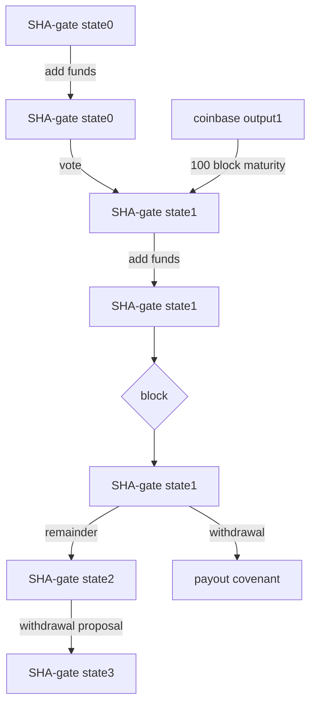

# Upgraded SHA-gate

This document is a description of an improved SHA-gate contract, starting from the problems of the SHA-gate V1 implementation. First the document goes into the technical changes from V1, then different discussion sections follow addressing common concerns, lastly a comparison table is made comparing V1, the present proposal (an upgraded version of V1) and the SBCH teams plan for V2.

Just like the Smart BCH teams 
[official plan for V2](https://smartbch.medium.com/the-plan-for-sha-gate-v2-1f1567f08db0) this version also has a m-of-n multisig of elected enclaves sign off on withdrawals in a first step. Crucially different is the second step where monitors have the option to block the withdrawal. In the official version this is done by yet another group of elected enclaves which would have to stake and face slashing for misbehaving. This proposal builds further on V1, where BCH miners are the monitors who have the option to block malicious withdrawals.

## Problems with V1

1) Each time a LP bridges funds to SBCH is a separate SHA-gate, this requires too much voting (which is the source of the "Bitmain firmware issue" & makes blocking invalid withdrawals too difficult)
 2) Trust-minimized bridge only usable for LPs, not normal users
 3) Contract does not check voting period which makes the setup insecure
 4) Impossible OP-return requirement
 5) Has just 3 operators with only 1 needed to propose a withdrawal

**The first three are major issues**, the fourth seems to be an attempted solution for issue three and the last problem makes the mechanism a lot less secure.

## New architecture

The first problem comes from the modular architecture of having Liquidity Providers (LPs) create separate SHA-gate contract to bridge a large sum each time. Instead you can have a reusable bridge which can bridge funds to SBCH many times and can process many withdrawals from SBCH back to the mainchain.

> 1) Each time a LP adds funds to SBCH is a separate SHA-gate which requires too much voting (this is the source of the "Bitmain firmware issue" & makes blocking invalid withdrawals too difficult)

Having a reusable bridge solves this first issue because miners only need to vote on one SHA-gate contract. This does away with the Bitmain Firmware issue and make the whole setup more secure. 
 
 - [x]  With new architecture miners need to vote one time each coinbase at most

The new architecture also solves the second issue. 
>  2) Trust-minimized bridge only usable for LPs, not normal users

On V1 users would be required to use trusted middlemen to bridge to SBCH because there would be a high minimum amount to open a valid SHA-gate because of the limited votes and resulting limited security (issue 1). It would also not be workable for users as you can only withdraw the same amount you entered SBCH with (a user would need to buy or sell the SBCH difference even if the minimum amount was not prohibitive), for LPs this would be workable but still very inflexible.

 - [x]   New architecture allows users to bridge to SBCH with minimal trust
 
 Using the trust minimized bridge to SBCH would only require a few block confirmations as reorg protection and would be viable bridging method for regular users. The withdrawal from the SBCH bridge would require waiting the full voting period which is not realistic for regular users.

To implement this new reusable architecture 3 changes are necessary

1) A new `Lock`  function is added to allow users to add funds to the SHA-gate. 
2) An amount is added to the withdrawal proposal to enable partial withdrawals with the rest redirected back to the SHA-gate.
3) To enable multiple simultaneous withdrawals for new SHA-gate, a withdrawal is a P2SH lock instead of a P2PK lock.

Having one big covenant instead of many small ones does not increase risk of smart contract hacks. It does however increase the amount that could be stolen by operator and miner collusion, hence the voting window would have to increase to make this infeasible .

*note: P2SH does not offer additional security as the full scripts of each covenant would always have known to allow for voting & supply transparency.*

At the end of the document a diagram is added to illustrate the new architecture.

  ## Voting period

The relative voting period is **complex** to reason about, **code inefficient** and most importantly **does not allow for constraining the voting period**.

> 3) Contract does not check voting period which makes the setup
> insecure

 A relative voting period does not allow for constraining the voting period because the contract needs to keep track of the start of the voting period to check if votes are valid. The contract can not access the blockheight or know how many blocks have passed and cannot use nLocktime because any earlier timestamp could be provided.

Fixed length voting period solves this as you know how many blocks passed at a minimum! The new contract uses parent transaction inspection to parse the `coinbase data` to get the blockheight of the newly mined block and compare this to this minimum blockheight of the voting period.

 - [x]  Upgraded contract uses fixed length voting period to enforce voting window

Changing the voting period to be fixed length allows to simplify the separate yes/no vote count, to one single`voteCount` variable which is incremented and decremented. Which is more space efficient and easier to reason about.

>  4) Impossible OP-return requirement

Requiring miners to put an OP-return to check for which of the many SHA-gates they want to vote for seems like a reasonable solution. The way it is implemented however they signal to vote for a certain `outpoint`this is problematic because it changes after each vote. Therefor by the time a coinbase transaction has reached a maturity of 100 blocks the tx-id will have changed and the vote will be invalid. 

The OP-return `outpoint` requirement would be a solution for the miner voting window were it not for the minimum maturity coinbase requirement, still it would only allow the votes to be added in a fixed order.

 - [x] New architecture gets rid of the need to signal for which SHA-gate you want to vote for, uniqueness of one vote per coinbase can be required by restricting voting vout to a certain index

  ## Proposing withdrawal
Instead of providing all public keys in the contract arguments a hash of their concatination can be provided and then only when initializing a new payout proposal will the full public keys matching this hash have to be provided. Then the multisig opcode can be used to require m signatures matching these n public keys. This way the withdrawal proposal has to be signed of by m-of-n operators signifcantly increasing its security. This approach also saves quit a lot on bytesize for the contract functions other than InitWithdrawal. The example code has a 3-of-5 multisig requirement but this can easily be extended because adding extra public keys and signatures to the multisig requirement adds very little in terms of opcodes and bytesize.

> 5.  Has just 3 operators with only 1 needed to propose a withdrawal

 - [x]  Changed initializing a proposal to be done by m-of-n operators, can fit 5-of-7 for example

If it is important that the provided public keys are all the same length this is best checked by adding this requirement in script manually because it is compiled very inefficieently in cashscript. Only big drawback of multisig is that the cashscriptSDK does not support it in a neat way yet, so additional code for this would have to be written.

  ## Contract size
The contract has an opcode count of 184 and a bytesize of 384. This is neatly within the respective 201 an 520 limitations and is even less than version 1's opcode count of 194 and bytesize of 504.

*The contract size is subject to change when the 3-of-5 multisig is replaced with a larger threshold and when the size check for the added publickeys is added manually to the script.*

  ## Discussion of malicious hashrate voting
Because Bitcoin Cash is a minority chain and because miner participation in electing SBCH validators has been low there has been worry about malicious hashrate voting.
First it is important to restate that miners only vote to reject or approve a withdrawal proposal initiated by m-of-n operators so 1 malicious operator would not be enough to initiate a malicious withdrawal proposal stealing all the funds. When the operators run verifyably authentic software by publishing the enclave attestation rapport associated with their public key it would be very difficult for a majority to collude to sign off on a malicious withdrawal. It is to prevent this case - and unitended software bugs - that hashrate voting is used as a second line of defence.

The current parameter is that 2/3rd of the votes should approve the withdrawal otherwise it does not go through. This means even if 51% of the votes were malicious the attempt would not even succeed. The ratio could even be increased further but the flip side of this is ofcourse that a malicious miner could block a valid withdrawal with only 33% of the miner voting. However this is mostly an inconvenience if it happens once and much less worrysome than a malicious withdrawal. In the first proposal the withdrawal was finished when atleast 50% voted approve (with a max of 30) and nobody voted in the last ~5hours. As outlined above this version works with a fixed length voting period and proposes to extend this to 2016 blocks (~2 weeks, which is the same length as the epoch for validator election). This ensures that even with low miner participation obtaining 66% malicious approval votes would be very difficult. Miners are a good choice for second line of defence because mining is costly, miners have some incentives to preserve the medium term success of the coin and lastly miners are truely independent from the voting that elects the operators. It would be rather pointless to have the same operators do the second approval step as this would in no way protect against malicious intent.

  ## Discussion of miner participation
The issue of lack of incentives for "monitors" is not unique to the miner voting SHA-gate. The same critique applies to Smart BCH teams [official plan for V2](https://smartbch.medium.com/the-plan-for-sha-gate-v2-1f1567f08db0) they expect monitors to run cloud enclaves and stake SBCH at the risk of slashing but why would they participate in this? The answer is that they would mainly do it out of altruism and because their incentives align with SBCH generally. Currently 50% of the fees on smartBCH are burned these could be used as direct compensation but unlike a mainchain a pegged sidechain has no option to inflate the supply to pay for the security budget. There is no discussion of any incentives for monitors in their article on V2.
To guarantee some active miner participation here has to be active outreach beyond the minimal effort to get some BCH miners to understand, support and commit to validating SBCH. It should be made as easy and hasstle free as possible for them, this is logical as you expect somebody to put in personal effort for something that has only indirect and abstract benefits. It is true that miner voting in the SHA-gate is more involved than miner voting for a validator but the need for a secure decentralized bridge has also been way more clearly demonstarted than the need for miners doing validor seclection. For the monitors it only makes sense to choose a group really different from the operators, for the validator selection this might not be the case. To be carefull not to overload miners work, selecting validators can be considered to got fully POS.

*Drivechain incentives miner participation by enabling them to earn sidechain fees without running a sidechain node through blind-merged mining. This is idea is not possible for POS sidechains however.*

  ## Discussion of tracking the covenant
Some concern was raised that it might be difficult to track simulated state UTXO. First it is important to realize that users bridging from BCH-SBCH will consume the SHA-gate UTXO but will not change its address. Only operators proposing a withdrawl, miner voting or finishing a withdrawal changes the covants address and these happen much less often, so the addres would only change every so many blocks. The new SHA-gate UTXO is always the first output of any spending transaction, the smart contract requires this so there is no need to check this. Simply listening to the address for outgoing transactions spending the UTXO and then using assigning the first output as new UTXO is enough to always have the latest state.

  ## Discussion of 3rd parties using the bridge

A consideration when choosing the design is how hard it is for wallets or other utilities to bridge from BCH -> SBCH. In the first design this did not require interaction with an existing UTXO but instead created a different UTXO for each bridging transaction. Here the 3rd party wanting to bridge funds using SHA-gate would need to querry a server for the latest state of the covenant (as it changes address and has a very long history). Once it has the latest state the transaction is easy, is can spend the SHA-gate UTXO provided that a larger amount is sent back to the same locking bytecode on index0, a 2nd output may be added as a change ouput like in other spending transactions. So 3rd parties using the SHA-gate directly do not need to construct advanced locking or unlocking scripts, just need to resend to the same smart contract address with a bigger amount.

  ## Discussion of LP markups

Under V1 LPs would only bridge a large sum when there's a sufficient markup on SBCH compared to BCH. Once this happened they stop caring about the bridge until they (or someone else) can buy back the same amount of SBCH for less BCH. This would mean there would be markups in both directions which is good for the LPs but bad for the users. The system isn't great for LPs either because it is very inflexible because they need to lock up large sums with questionable security because of the voting issue. In this setup the price of SBCH could be higher and lower than the BCH price, until LPs can profitably move a large sum either direction.

With the second version anybody would be able to bring extra BCH over to SBCH meaning the markup would be completely gone, to the benefit of the regular users. There would probably still be a markup for bridging back as this takes waiting the rather long voting period before you get back your funds. A difference in SBCH <-> BCH price enough to cover this waiting period sets the predictable exchange range.
Price BCH >= Price SBCH >= Price BCH - waiting cost

Where first the markups came from the LPs privileged position of passing the high minimum threshold & maybe having direct miner connections for safe voting, markups now just come from the fact that the withdrawal process with voting takes time.

  ## Open design choice

With the current setup miners vote with a dust output fromt the coinbase, this is presumaly a P2PKH output and would require miners to interact with the SHA-gate smart contract and sign the coinbase vote output.

Instead it is also possible to let miners create a P2SH vote coveant output, which makes them vote **before** mining a block. This would allow anybody to add the votecovenant to the SHA-gate contract. 

Depending on miner software this might or might not be superior.

  ## P2SHash vulnerability

BCH still uses 20 byte P2SHashes for smart contracts which opens them up to profitable collision attacks when holding balances upwards of a few hundred thousand USD (see post on [Bitcoin Cash Research forum](https://bitcoincashresearch.org/t/p2sh32-a-long-term-solution-for-80-bit-p2sh-collision-attacks/750)). SHA-gate is less vulnerable to this attack as it only allows operators to add arbitrary data to the state. Currently this vulnerability is the biggest hurdle for the SHA-gate, but it is an advanced attack to pull off and is planned to be fixed May 2023. A transition to SHA-gate would be gradual and should for safety be halted at 10 million USD or so until BitcoinCash has upgraded to 32bytes P2SH.

  ## Comparison to SBCH teams Plan for V2

 The upgraded V1 column refers to the current proposal with miner voting

| comparison   |   original V1  | upgraded V1    |  plan for official V2 |
|----------|:-------------:|:-------------:|:------:|
| initiating withdrawals | 1-of-n operators| m-of-n operators| m-of-n operators |
| withdrawals | separate for every withdrawal from SBCH |batched every two weeks | separate for every withdrawal from SBCH |
| monitors checking withdrawals |   miners   |  miners   |   elected enclaves |
| number of SHA-gate UTXOs |  one for each BCH -> SBCH bridging | 1 |  one for each BCH -> SBCH bridging | 
SHA-gate address | changes every few blocks  | changes every few blocks  |  changes only when operators or monitors change |

There are two separate choices up for discussion
1) whether to have miners or elected enclaves monitor the withdrawals
2) whether to have one main contract holding all the funds and batch withdrawals or have many separate UTXOs

  ## Diagram

Diagram of how the miner voting SHA-gate would work with the new reusable architecture (disregarding the vote-covenant option discussed in the "Open design choice" paragraph).

